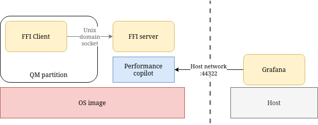

# ${{values.component_id}}

${{values.description}}

## About this example

This example project demonstrates how AutoSD effectively constrains the memory
usage in the QM partition, while avoiding interferences outside of it.

The example includes performance monitoring features both embedded in the image,
and as external containers that can be brought up using compose.

## Architecture

This demo features two containerized agents that communicate
between each other through a UNIX socket at `/run/ipc/ffi_server.socket`.

    

