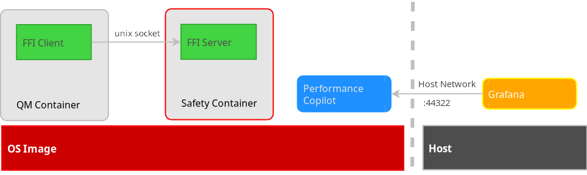
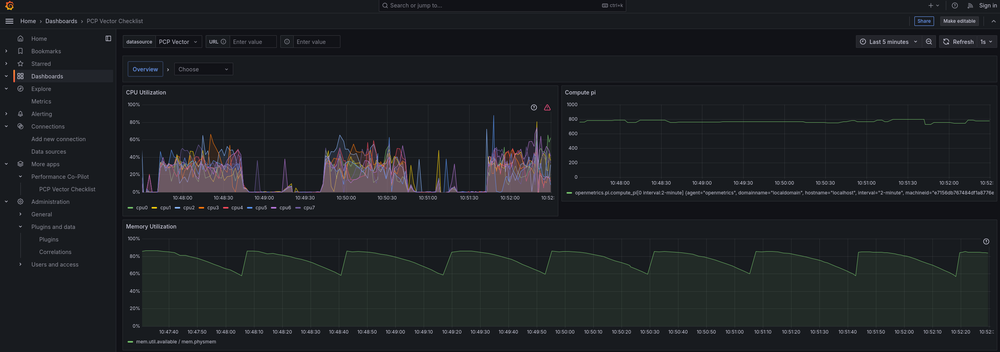

# FFI Demo

This example project demonstrates how AutoSD effectively constrains the memory
usage in the QM partition, while avoiding interferences outside of it.

The example includes performance monitoring features both embedded in the image,
and as external containers that can be brought up using compose.

## Architecture

This demo features two containerized agents that communicate
between each other through a UNIX socket at `/run/ipc/ffi_server.socket`.

<div align="center">
    
</div>


### Listener agent

On the one hand, we have a listener agent that will remain actively
listening on `/run/ipc/ffi_server.socket`. The container resides in the
outside the qm partition.

The agent merely listens and prints the received memory dump data.
It shall not lose any message, be interrupted, or killed by the supervisor.

### Malicious agent

On the other hand, we have an agent in the QM partition that connects to the
listener outside that partition. It consumes chunks of memory, and sends
its latest memory consumption data through the UNIX socket.

Memory consumption of this service is limited to 50% of the available memory.

### Monitoring

The example includes a built-in monitoring system, with some services
adding, among others:
- Advanced logging
- [Redis](https://redis.io/) server
- [Performance Co-Pilot](https://pcp.io/) API server on the port 44322
- [Grafana](https://grafana.com/) container available on the host

## Expectations

The QM agent starts eating memory faster and faster. Consequently, its
service shall get killed and restarted by the supervisor, as it will
violate the memory restriction policy. This will keep happening in cycles.

Despite this memory-hungry process running, the agent in the Safety layer
shall remain unaffected, up and running.

## Build the demo

The following sections assume:
- you have a local clone of this repository
- you have podman, podman-compose and [automotive-image-builder](https://gitlab.com/CentOS/automotive/src/automotive-image-builder/)
  installed on the host
- you have sudo priviledges on the host system

### Build the container images

* Get into the `containers` folder and run the `build.sh` script that will
  build the desired container images and store them in your local container
  storage:

```shell
cd containers
sudo bash build.sh
```

At this point you should be able to see these container images using `sudo
podman images`. The output should looks similar to this:

```
$ sudo podman images
REPOSITORY                                              TAG         IMAGE ID      CREATED       SIZE
localhost/ffi_server                                    latest      fab371fd36dc  25 hours ago  366 MB
localhost/ffi_client                                    latest      a1d0554ff928  25 hours ago  382 MB
...
```

### Build the OS image

* Get into the `images` folder and run the `build.sh` script. This will
  create a `qcow2` VM image that can then be run with qemu.

```shell
cd images
bash build.sh
```

## Run demo

### Start the OS image

In the previous step we built a qcow2 image using `automotive-image-builder`.
We can now run it using `automotive-image-runner` which is a convenient wrap-up
script around qemu.

Here is the command you can use:

```shell
$ automotive-image-runner --port-forward "44322:44322" ffi.x86_64.qcow2
```

QEMU window will pop up, use `root` / `password` to log in.

You can check each agent's logs:
- `ffi_server.service`
  - Available in the Safety layer.
  - We can see all the logs for data coming from the client with no
    interruption of the service or data loss.
- `ffi_client.service`
  - You need to connect to the QM layer to see this service.
    ```shell
    $ podman exec -it qm bash
    ```
  - Logs show how the service is periodically killed and restarted.
    ```
    ...
    ... 35fc8b0b06d0 systemd[1]: ffi_client.service: A process of this unit has been killed by the OOM killer.
    ...
    ... 35fc8b0b06d0 systemd[1]: Stopped ffi_client container.
    ...
    ... 35fc8b0b06d0 systemd[1]: Starting ffi_client container...
    ...
    ... 35fc8b0b06d0 systemd[1]: Started ffi_client container.
    ...
    ```

### Run Grafana

Now that we have the OS image running, we can start the monitoring stack
that shows the QM proceed eating memory, being killede and restarting.
This is achieved by running in a container on the host system a Grafana
instance, coupled with a prometheus that collects the data while Grafana
displays them.

To get Grafana up and running, having podman-compose installed, get into
the `grafana` folder and run `build.sh`.

```shell
cd grafana
bash build.sh
```
You will get the Grafana logs in the terminal. You can use Ctrl+C to exit.
This may not stop all the pods, you can verify this using:

```shell
$ podman-compose ps
CONTAINER ID  IMAGE                             COMMAND     CREATED             STATUS             PORTS       NAMES
02dfcc235fef  docker.io/grafana/grafana:11.3.1              About a minute ago  Up About a minute  3000/tcp    grafana
```

To properly stop the pods, or in case of errors like `already exists` or
`already in use`, try to execute:
```shell
$ podman-compose down
```

To access Grafana's UI, open a web-browser and visit the address `localhost:3000`.
There, using the menu on the left hand side select `Dashboards` and then select
the one named `PCP Vector Checklist`.

At first the dashboard displayed does not integrate the compute_pi panel showing
how long it takes to compute pi with 500,000 digits. In order to have that panel
show we need to update the dashboard.
This can be easily achieved by running, in another terminal window, in the
`grafana` folder:
```shell
python update_dashboard.py
```

Leave it running for some time and swap memory graphics should show how the
memory grows and gets emptied after each consume cycle.

<div align="center">
    
</div>


## Credits

This FFI demo is based on the work done in [autosd-demo](https://gitlab.com/CentOS/automotive/src/autosd-demo/-/tree/main/examples/ffi-demo?ref_type=heads)
to use automotive-image-builder and the simplified manifest format that it
developed.
